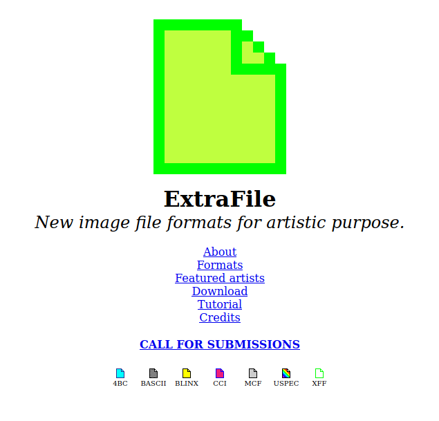
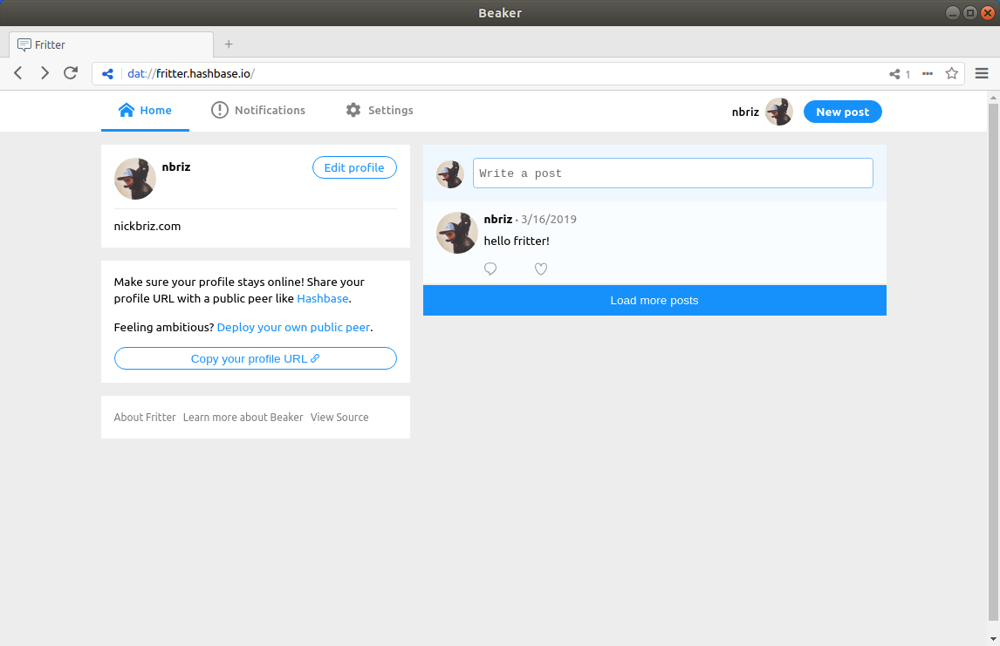
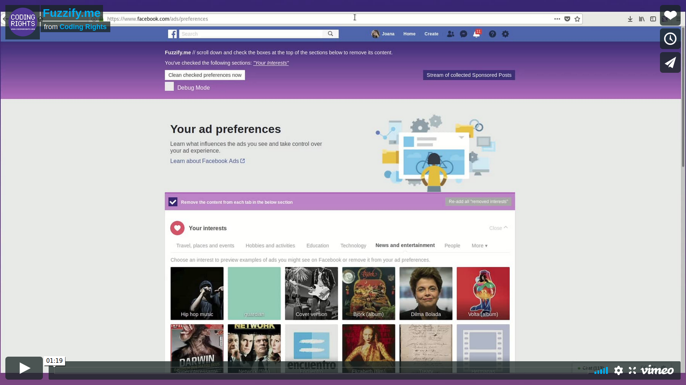

# FLOSS

## Free/Libre Open Source Software

Let’s keep going with the analogy from that video to explain how a typical proprietary (copyright) software license might work in "recipe form". With proprietary software the source-code is hidden/secret (closed source) so you never get access to the recipe, instead you’ve got to buy pre-packaged microwavable meals. You don’t technically “own” these microwavable meals, you simply “license” them, which means you’re allowed to use the meal as per a set of "terms and agreements" you must spend a few hours reading and agree to before every time you pop it into the microwave (these can change regularly, so you should budget an hour or so of time to read them before every meal). These terms govern what you are and aren’t allowed to do, for example: you would typically be allowed to eat the meal when it comes out of the microwave, but you can’t share any part of your meal with your friend (they have to purchase their own microwavable meal). Additionally, there may be restrictions on the kind of microwave and plate you’re allowed to use to cook your meal (these restrictions are legal, not technical of course, in theory any microwave or plate works, you’re just not allowed to use them). This might get frustrating, especially considering how unappetising this microwavable meal is; it’s so bad your first thought after biting into it might be “this needs some salt or hot sauce or something”, but you can’t add any of that, because any/all modifications to the meal are strictly prohibited.

At this point you might say to yourself, “Forget this, I'm going to make my own version of this dish from scratch”... sure, in theory that’s ok, but you can’t do so by looking at the back of the box and reading the ingredients list (that’s kept secret, a bit scary when you think to ask, “how do we know it’s safe?”), you could try to “reverse engineer” it, by teasing apart the individual pieces of mush in the meal… but that’s difficult because the company producing them added some extra goo to the mush meal (DRM) to make it difficult to mess with  and it’s also likely against that initial terms and agreement you signed to even try to “reverse engineer” it. At this point you might be pretty frustrated and so you think, “Screw it, I’ve got like 10 boxes of this junk left, I'm going to use it prop up my desk instead of eating it”... but that too might be against the terms and conditions, in the section covering what you’re allowed to do and not do with your licensed microwavable meal.

## Free Software
### an ideological position

As it is often explained, the “free” in Free Software, isn’t about money (though technically yes, it usually happens to be “free” as in “free beer”) rather it’s about “freedom”. In mid 1980s the founders of the free software movement defined a couple of key freedoms, “First, the freedom to copy a program and redistribute it to your neighbors, so that they can use it as well as you. Second, the freedom to change a program, so that you can control it instead of it controlling you; for this, the source code must be made available to you.” Today Free Software is defined by the following “four freedoms”:

- The freedom to run the program as you wish, for any purpose (freedom 0).

- The freedom to study how the program works, and change it so it does your computing as you wish (freedom 1). Access to the source code is a precondition for this.

- The freedom to redistribute copies so you can help your neighbor (freedom 2).

- The freedom to distribute copies of your modified versions to others (freedom 3). By doing this you can give the whole community a chance to benefit from your changes. Access to the source code is a precondition for this.

## Open Source
### an apolitical position

The term “open source” software refers to a software development model which came from the Free Software movement but wanted to disassociate itself from the politics (the ideological impetus) of the Free Software movement and instead rather focus on the practical (even commercial) benefits of open source development. Here are just a couple:

- One immediate advantage is having the freedom to build their software on top of the works of others (whether that's remixing other open source projects or combining different projects in the form of software libraries or APIs)

- Another benefit is removing the friction of a price. Software is an information good, which in economic terms makes it [non-rivalrous](https://en.wikipedia.org/wiki/Rivalry_(economics)), this means pricing software above it's marginal cost of $0 introduces artificial scarcity, and while that is a business model some software products use, the most financially successful software companies today instead opt to leverage the infinite reproduceability of software products (albeit, often in favor of other, much more problematic, business models, see [surveillance capitalism](https://en.wikipedia.org/wiki/Surveillance_capitalism))

- Another example is taking advantage of the [long tail](https://en.wikipedia.org/wiki/Long_tail) of possible contributors (more than any single company could ever hope to hire to work on a software project).

# Artware

Beyond the convention utilitarian software...

## Critical Software

"...software designed explicitly to pull the rug from underneath normalised understanding of software [...] Critical software engages with existing software programmes and mutates or critically analyses them." (Fuller) Critical Software is software as critical commentary, where thing being commented on is software products and software ideas.

[ExtraFile](https://web.archive.org/web/20120628124112/http://extrafile.org/) by Kim Asendorf (2011)

## Social Software

> "[Social Software] primarily, it is software built by and for those of us locked out of the narrowly engineered subjectivity of mainstream software. It is software which asks itself what kind of currents, what kinds of machine, numerical, social, and other dynamics, it feeds in and out of, and what others can be brought into being" furthermore, "It is software that is directly born, changed, and developed as the result of an ongoing sociability between users and programmers in which demands are made on the practices of coding that exceed their easy fit into standardised social relations"

— Fuller, Matthew. Behind the Blip: Essays on the Culture of Software. autonomedia. 2003.

[Sombody](http://somebodyapp.com/) by Miranda July (2014)

## Speculative Software

> The best fiction is always also attempting to deal with the crisis of written language, in the way that it asks itself about the legacy built into text as the result of its birth in the keeping of records, in the establishment of laws, in assembling and managing tables of debt and credit. It does this perpetually, at the same time as reinventing and expanding upon the capacity of language to create new things. Speculative software fulfills something of a similar function for digital cultures. (Fuller)

[Beaker Browser](https://beakerbrowser.com/) by Paul Frazee and Tara Vancil (2016-present)

## Hacktivist Software

[Fuzzify.me](https://vimeo.com/284292381) by Hang Do Thi Duc, Becca Ricks and Joana Varon (2018) -- [visit their github repository](https://github.com/d4t4x/facebook-cleaner)

# Git + GitHub

So there are two things to differentiate between here, [git](http://git-scm.com/) and [GitHub](https://github.com/), git is a version control system or VCS (aka revision control) command line application. A VCS is essentially a way of creating snapshots (“committed” changes) of your code while you work on it and keep it in a history. You can also create “branches” (versions or alternate narratives--if you will--to this history). GitHub is a website which serves a few purposes, including [1] functioning as a backup for your project, [2] lets you share your code with the world in an organized manner and [3] makes it easy to collaborate with others on code based projects. (**NOTE:** though GitHub is likely the most popular, it isn't the only website of it's kind, there's also [BitBuckt](https://bitbucket.org/) and [Gitlab](https://about.gitlab.com/) to name a couple)

git comes with it’s own unique vernacular which is important to understand before moving forward (it’s too easy to get lost in the lingo) besides “version control” and “command line” there’s also:

- **repository**: also colloquially referred to as a “repo”, is essentially what you call a “versioned” project (the main difference between a regular project and a versioned project being that there’s a hidden `.git` folder keeping track of all your changes, and thus it’s “versioned”)

- **add**: adds a file to your “stage”, only the files on stage will be included in your version history.

- **commit**: this is essentially a “snapshot” of what your code base looks like at that moment, it’s how you “save” on github, think of it as a point in your project’s history timeline.

- **push**: if your repo is hosted on github (not just versioned with git on your computer) you can update your github backup by uploading your latest commits using the push command.

- **branch**: this is like a parallel timeline in your history. Many users will have a “dev” (or developing) branch where they’re working on new features and they’ll keep their “master” (the main/initial timeline) only as up to date with the tested/functioning features. Branches are useful for collaboration. There can be more than one user authorized to work on a repo, keeping separate branches can help keep things organized.

- **merge**: this is what you call it when a branch’s changes get’s applied to another branch (ex: when you “merge” your dev branch into your master branch, or when a collaborator working on her branch merges her changes into the group’s master branch)

- **clone**: git's word for "copying" a repository (different from "downloading" a project from github, which won't include that .git folder, ie. the versioned history)

- **fork**: when a project is “open-source” and hosted on github there’s the potential for anyone to collaborate on the project, but this doesn’t mean they have access to commit/push to the repo (that would be chaos, and open-source is anything but) instead what you can do is “clone” your own version of that repo into a separate repository hosted on your own account. Your version would be a “fork” of the original repo.

- **pull request**: say you’ve made some impressive changes to a project that you forked and you think it should be incorporated into the main project’s repository, you can send them a special message (this is the “pull request”) to the original repo’s owners which lets them know you’ve made some important changes they should consider including into the original repo.

- **remote**: what you call a backup copy of your repo somewhere else on the Internet. It's common to have a remote backup (typically on a site like github or bitbucket, though you could back it up to your own server using something like gitlab)

## Setting up your Repo

Now that your familiar with the basic language, you’re ready to start versioning. First thing you want to do is create a repository, This is easiest on GitHub by clicking the big green “new repository” button. There you can give it a name and description. You’ll also have the choice to make it public or private. Rather than starting an empty repo it’s best to start it (ie. initialize it) with a README file (this is a markdown file with your projects basic info) and might also help to start a .gitignore and/or a license

**Marddown Files:** you can learn markdown basics [John Gruber](http://daringfireball.net/projects/markdown/basics)'s page (Gruber along with  [Aaron Swartz](https://en.wikipedia.org/wiki/Aaron_Swartz) developed markdown) and/or check out github's [reference](https://help.github.com/articles/getting-started-with-writing-and-formatting-on-github/).

**Choosing a License:** [https://choosealicense.com/](https://choosealicense.com/)

Once created, copy the repo cloning URL and in your terminal (in the directory you want your project to be) type `git clone UR_COPIED_URL` and it'll clone your repo (readme, license and all) to your laptop.

You might not want to have your project on github just yet, if that's the case you can turn any local project into a repo in the command line, assuming your present working directory (`pwd`) is that of the project you want to version, run `git init` to initiatlize the repo. Then later when you want to back it up to github, you can create a repo on github (don't initialize with a README this time) and then take the git URL it creates and back in your terminal run `git add remote UR_GIT_URL`

Now your ready to start versioning! Assuming you're in the same directory as the git project, below is a simple versioning workflow:

*if it's the first time you use git (after installing it), not a bad idea to do a little [setup](https://git-scm.com/book/en/v2/Getting-Started-First-Time-Git-Setup) first*

- `git status` checks the current state of the local repo (are there any new files to stage? was an older file modified? or deleted?). not necessary to do this, but useful (try it between each of the following steps).

- `git add filename.html`
"stage" a file to be commited (any new file or modified file), you can stage any/all, `git add -A` will add everything that's newly modified. if you want to undo a staging use `git reset`

- `git commit -m "message goes here"`
creates a "snapshot" of the present state of the repo, includes a message that explains what you added/changed this time around

- `git push origin master`
push your local changes to your upstream public repository, in this case your specifically pushing whichever branch your currently on locally (you can check which branch your own by `git branch`) to your master branch on github.

**Check out the Atom "[fligth manual](https://flight-manual.atom.io/using-atom/sections/github-package/)" for instrutions on how to use the Git/GitHub features integrated into the code editor itself**

that’s just the tip of the iceberg, we recommend spending 15 mins to go through the [try.github.io](https://try.github.io/levels/1/challenges/1) interactive tutorial and there’s lots more beyond that to learn along the way. Check out github’s [help](https://help.github.com/) page as well as their [guides](https://guides.github.com/) for more info.

For more on how to participate in Open Source culture check out GitHub's [Open Source Guides](https://opensource.guide/).

Any other questions, feel free to email us at hi@netizen.org
